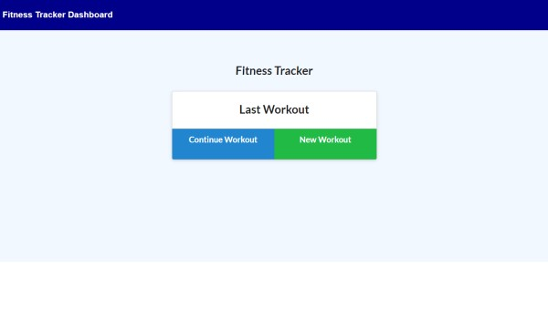

# 🔗 [Fitness Tracker](https://github.com/kjhallam/17_fitness_tracker.git)

## LICENSE

---

## 📓 DESCRIPTION

* As a user, I want to be able to view create and track daily workouts. I want to be able to log multiple exercises in a workout on a given day. I should also be able to track the name, type, weight, sets, reps, and duration of exercise. If the exercise is a cardio exercise, I should be able to track my distance traveled.

---

## 📋 Table of Contents

  1. [DESCRIPTION](#description)
  2. [INSTALLATION](#installation)
  3. [USAGE](#usage)
  4. [CONTRIBUTING](#contributing)
  5. [TEST](#test)
  6. [GITHUB](#github)
  7. [SCREENSHOT](#screenshot)
  8. [QUESTIONS](#questions)
  
---

## ⬇️ INSTALLATION

Mongoose, MongoDB, NPM I (package json), NPM express, MongoDB Atlas (for Deploying the Database).

---

## 📓 USAGE

When a user loads the page, they are given 2 options (create a workout or continue the progress of a previous workout).

  - User is able to add a workout/ add to previous workout.
  - User is able to create a workout.
  - View the combined workouts in a chart.

---
## 📓 CONTRIBUTING

N/A

---

## 🧪 TEST

N/A

---

## :octocat: GITHUB

[https://github.com/kjhallam](http://github.com/https://github.com/kjhallam)

---

## HEROKU

🏋️‍♀️ [FITNESS APP](http://fitness-17.herokuapp.com)

---

## 📷 SCREENSHOTS

---

## ❔ QUESTIONS

If any questions concerning the use of the markdown file contact me at ✉️ [Email](kjhallam321@gmail.com).
